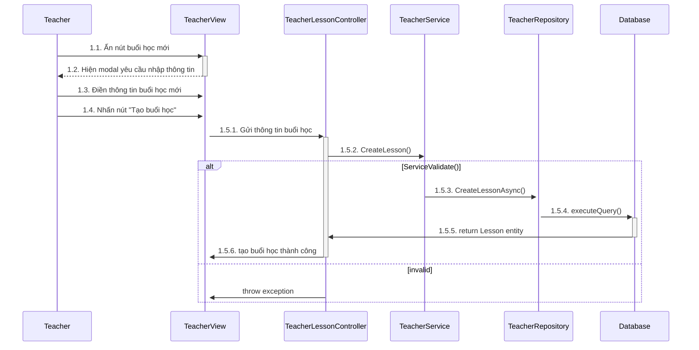
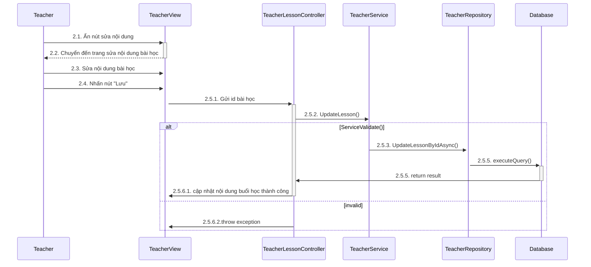
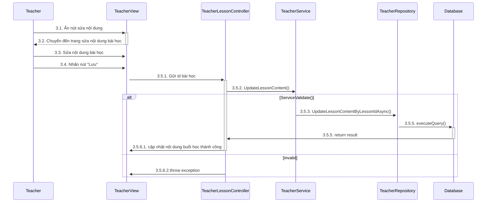
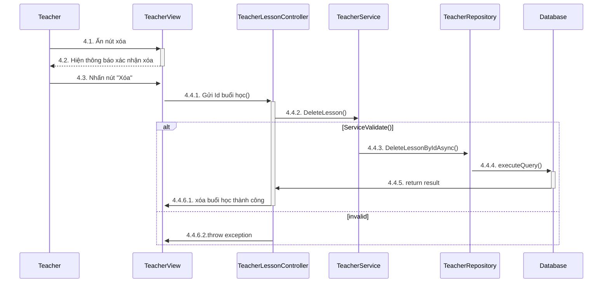
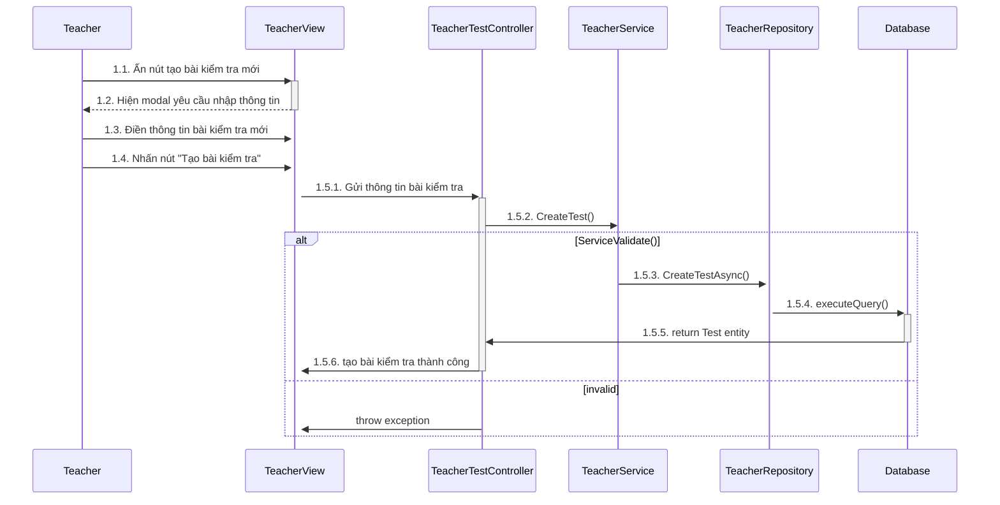
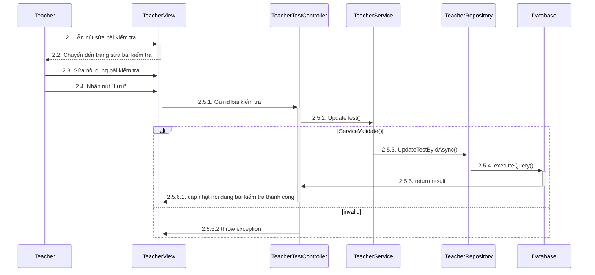
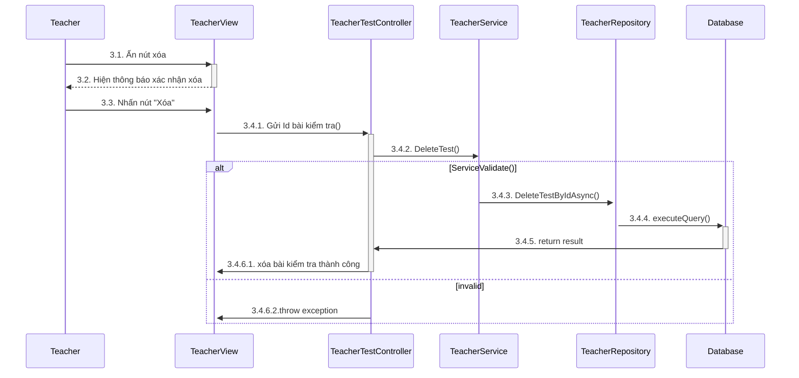
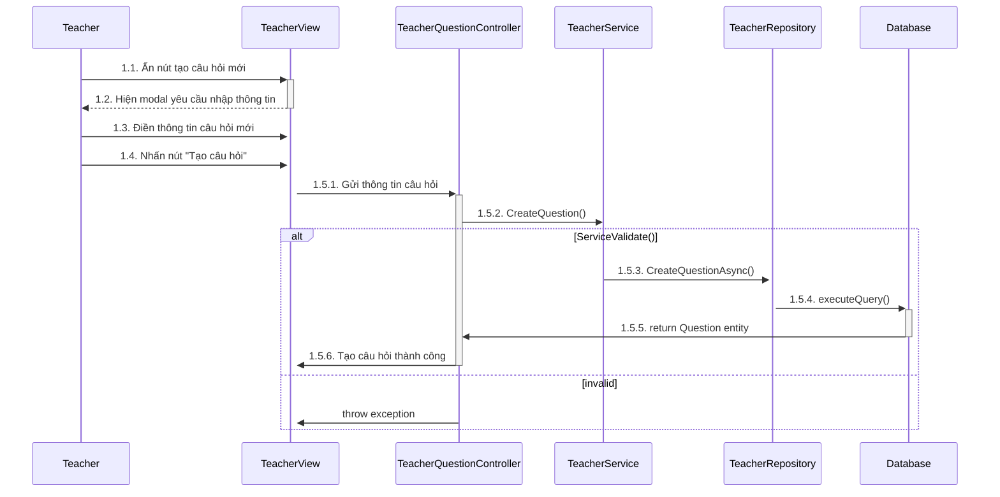
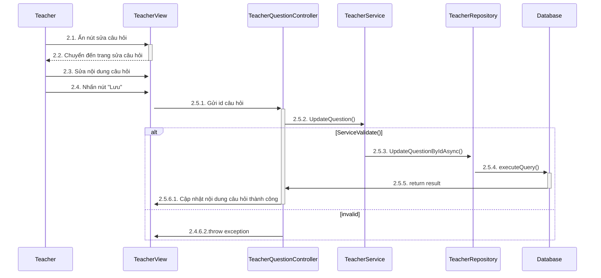
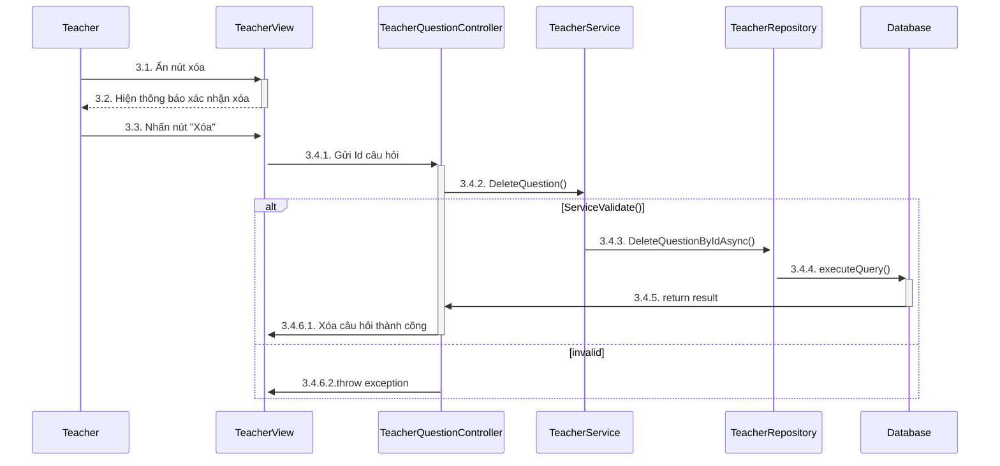

## Use-case 1. Quản lý buổi học

- Sequence 1.1: Giảng viên thêm buổi học

- Sequence 1.2: Giảng viên cập nhật buổi học

- Sequence 1.3: Giảng viên cập nhật nội dung buổi học

- Sequence 1.4: Giảng viên xóa buổi học

## Use-case 2. Quản lý bài kiểm tra của bài học

- sequence 2.1: Giảng viên thêm bài kiểm tra

- sequence 2.2: Giảng viên cập nhật bài kiểm tra

- sequence 2.3: Giảng viên xóa bài kiểm tra

## Use-case 3. Quản lý câu hỏi của bài học

- sequence 3.1: Giảng viên thêm câu hỏi

- sequence 3.2: Giảng viên cập nhật câu hỏi

- sequence 3.3: Giảng viên xóa câu hỏi

