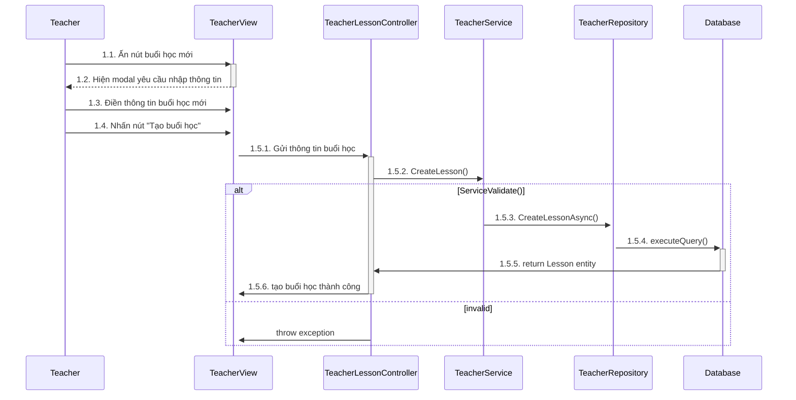

```mermaid
sequenceDiagram
    participant Teacher
    participant TeacherView
    participant TeacherLessonController
    participant TeacherService
    participant TeacherRepository
    participant Database

    Teacher->>+TeacherView: 1.1. Ấn nút  buổi học mới
    TeacherView-->>-Teacher: 1.2. Hiện modal yêu cầu nhập thông tin
    Teacher->>+TeacherView: 1.3. Điền thông tin buổi học mới
    Teacher->>+TeacherView: 1.4. Nhấn nút "Tạo buổi học"
    TeacherView->>+TeacherLessonController: 1.5.1. Gửi thông tin buổi học
    TeacherLessonController->>TeacherService: 1.5.2. CreateLesson()
    alt ServiceValidate()
        TeacherService->>+TeacherRepository: 1.5.3. CreateLessonAsync()
        TeacherRepository->>+Database: 1.5.4. executeQuery()

        Database->>-TeacherLessonController: 1.5.5. return Lesson entity
        TeacherLessonController->>-TeacherView: 1.5.6. tạo buổi học thành công
    else invalid
        TeacherLessonController->>TeacherView: throw exception
    end
```
