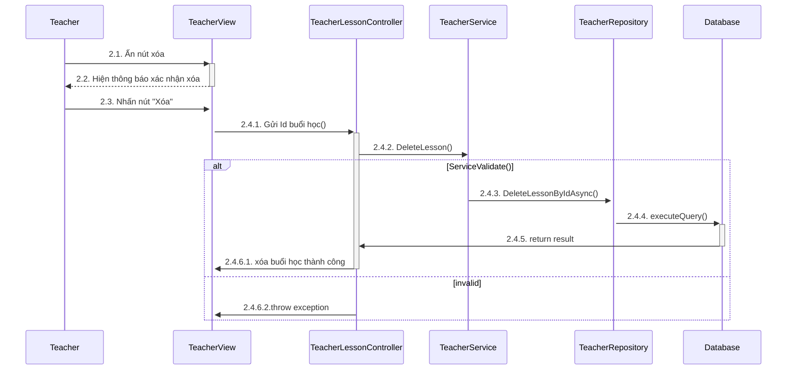

```mermaid
sequenceDiagram
    participant Teacher
    participant TeacherView
    participant TeacherLessonController
    participant TeacherService
    participant TeacherRepository
    participant Database

    Teacher->>+TeacherView: 2.1. Ấn nút xóa
    TeacherView-->>-Teacher: 2.2. Hiện thông báo xác nhận xóa
    Teacher->>+TeacherView: 2.3. Nhấn nút "Xóa"
    TeacherView->>+TeacherLessonController: 2.4.1. Gửi Id buổi học()
    TeacherLessonController->>TeacherService: 2.4.2. DeleteLesson()
    alt ServiceValidate()
        TeacherService->>+TeacherRepository: 2.4.3. DeleteLessonByIdAsync()
        TeacherRepository->>+Database: 2.4.4. executeQuery()

        Database->>-TeacherLessonController: 2.4.5. return result
        TeacherLessonController->>-TeacherView: 2.4.6.1. xóa buổi học thành công
    else invalid
        TeacherLessonController->>TeacherView: 2.4.6.2.throw exception
    end
```
