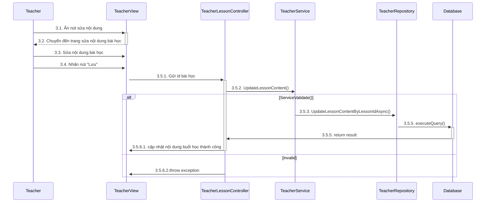

```mermaid
sequenceDiagram
    participant Teacher
    participant TeacherView
    participant TeacherLessonController
    participant TeacherService
    participant TeacherRepository
    participant Database

    Teacher->>+TeacherView: 3.1. Ấn nút sửa nội dung
    TeacherView-->>-Teacher: 3.2. Chuyển đến trang sửa nội dung bài học
    Teacher->>+TeacherView: 3.3. Sửa nội dung bài học
    Teacher->>+TeacherView: 3.4. Nhấn nút "Lưu"
    TeacherView->>+TeacherLessonController: 3.5.1. Gửi id bài học
    TeacherLessonController->>TeacherService: 3.5.2. UpdateLessonContent()
    alt ServiceValidate()
        TeacherService->>+TeacherRepository: 3.5.3. UpdateLessonContentByLessonIdAsync()
        TeacherRepository->>+Database: 3.5.5. executeQuery()

        Database->>-TeacherLessonController: 3.5.5. return result
        TeacherLessonController->>-TeacherView: 3.5.6.1. cập nhật nội dung buổi học thành công
    else invalid
        TeacherLessonController->>TeacherView: 3.5.6.2.throw exception
    end
```
