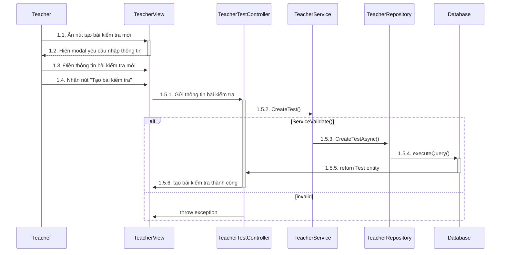

```mermaid
sequenceDiagram
    participant Teacher
    participant TeacherView
    participant TeacherTestController
    participant TeacherService
    participant TeacherRepository
    participant Database

    Teacher->>+TeacherView: 1.1. Ấn nút tạo bài kiểm tra mới
    TeacherView-->>-Teacher: 1.2. Hiện modal yêu cầu nhập thông tin
    Teacher->>+TeacherView: 1.3. Điền thông tin bài kiểm tra mới
    Teacher->>+TeacherView: 1.4. Nhấn nút "Tạo bài kiểm tra"
    TeacherView->>+TeacherTestController: 1.5.1. Gửi thông tin bài kiểm tra
    TeacherTestController->>TeacherService: 1.5.2. CreateTest()
    alt ServiceValidate()
        TeacherService->>+TeacherRepository: 1.5.3. CreateTestAsync()
        TeacherRepository->>+Database: 1.5.4. executeQuery()

        Database->>-TeacherTestController: 1.5.5. return Test entity
        TeacherTestController->>-TeacherView: 1.5.6. tạo bài kiểm tra thành công
    else invalid
        TeacherTestController->>TeacherView: throw exception
    end
```
