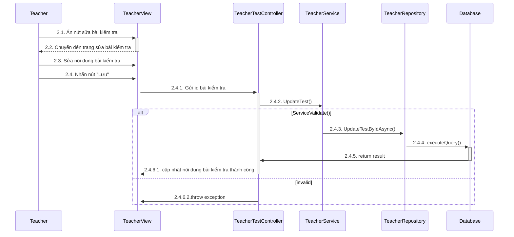

```mermaid
sequenceDiagram
    participant Teacher
    participant TeacherView
    participant TeacherTestController
    participant TeacherService
    participant TeacherRepository
    participant Database

    Teacher->>+TeacherView: 2.1. Ấn nút sửa bài kiểm tra
    TeacherView-->>-Teacher: 2.2. Chuyển đến trang sửa bài kiểm tra
    Teacher->>+TeacherView: 2.3. Sửa nội dung bài kiểm tra
    Teacher->>+TeacherView: 2.4. Nhấn nút "Lưu"
    TeacherView->>+TeacherTestController: 2.4.1. Gửi id bài kiểm tra
    TeacherTestController->>TeacherService: 2.4.2. UpdateTest()
    alt ServiceValidate()
        TeacherService->>+TeacherRepository: 2.4.3. UpdateTestByIdAsync()
        TeacherRepository->>+Database: 2.4.4. executeQuery()

        Database->>-TeacherTestController: 2.4.5. return result
        TeacherTestController->>-TeacherView: 2.4.6.1. cập nhật nội dung bài kiểm tra thành công
    else invalid
        TeacherTestController->>TeacherView: 2.4.6.2.throw exception
    end
```
