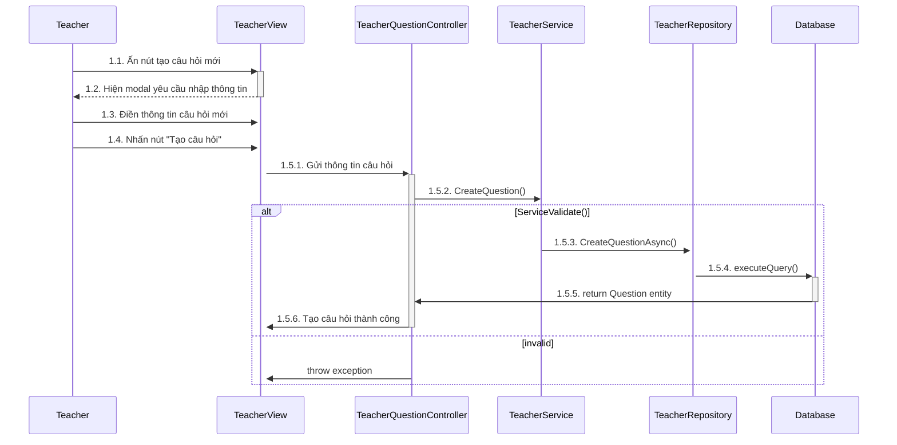

```mermaid
sequenceDiagram
    participant Teacher
    participant TeacherView
    participant TeacherQuestionController
    participant TeacherService
    participant TeacherRepository
    participant Database

    Teacher->>+TeacherView: 1.1. Ấn nút tạo câu hỏi mới
    TeacherView-->>-Teacher: 1.2. Hiện modal yêu cầu nhập thông tin
    Teacher->>+TeacherView: 1.3. Điền thông tin câu hỏi mới
    Teacher->>+TeacherView: 1.4. Nhấn nút "Tạo câu hỏi"
    TeacherView->>+TeacherQuestionController: 1.5.1. Gửi thông tin câu hỏi
    TeacherQuestionController->>TeacherService: 1.5.2. CreateQuestion()
    alt ServiceValidate()
        TeacherService->>+TeacherRepository: 1.5.3. CreateQuestionAsync()
        TeacherRepository->>+Database: 1.5.4. executeQuery()

        Database->>-TeacherQuestionController: 1.5.5. return Question entity
        TeacherQuestionController->>-TeacherView: 1.5.6. Tạo câu hỏi thành công
    else invalid
        TeacherQuestionController->>TeacherView: throw exception
    end
```
