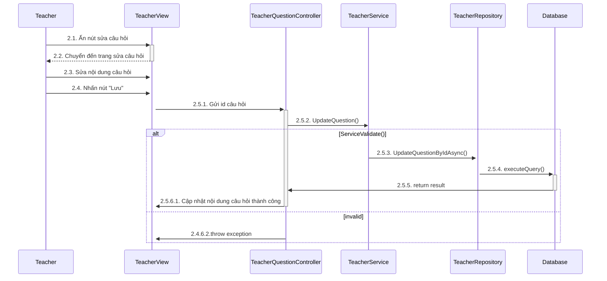

```mermaid
sequenceDiagram
    participant Teacher
    participant TeacherView
    participant TeacherQuestionController
    participant TeacherService
    participant TeacherRepository
    participant Database

    Teacher->>+TeacherView: 2.1. Ấn nút sửa câu hỏi
    TeacherView-->>-Teacher: 2.2. Chuyển đến trang sửa câu hỏi
    Teacher->>+TeacherView: 2.3. Sửa nội dung câu hỏi
    Teacher->>+TeacherView: 2.4. Nhấn nút "Lưu"
    TeacherView->>+TeacherQuestionController: 2.5.1. Gửi id câu hỏi
    TeacherQuestionController->>TeacherService: 2.5.2. UpdateQuestion()
    alt ServiceValidate()
        TeacherService->>+TeacherRepository: 2.5.3. UpdateQuestionByIdAsync()
        TeacherRepository->>+Database: 2.5.4. executeQuery()

        Database->>-TeacherQuestionController: 2.5.5. return result
        TeacherQuestionController->>-TeacherView: 2.5.6.1. Cập nhật nội dung câu hỏi thành công
    else invalid
        TeacherQuestionController->>TeacherView: 2.4.6.2.throw exception
    end
```
